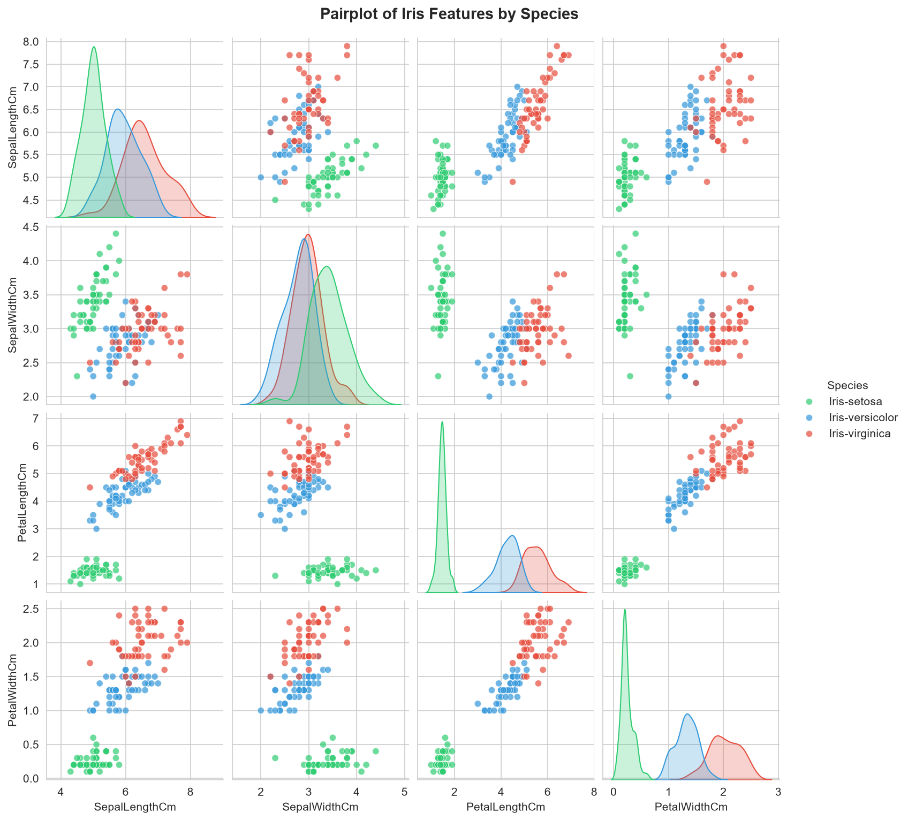
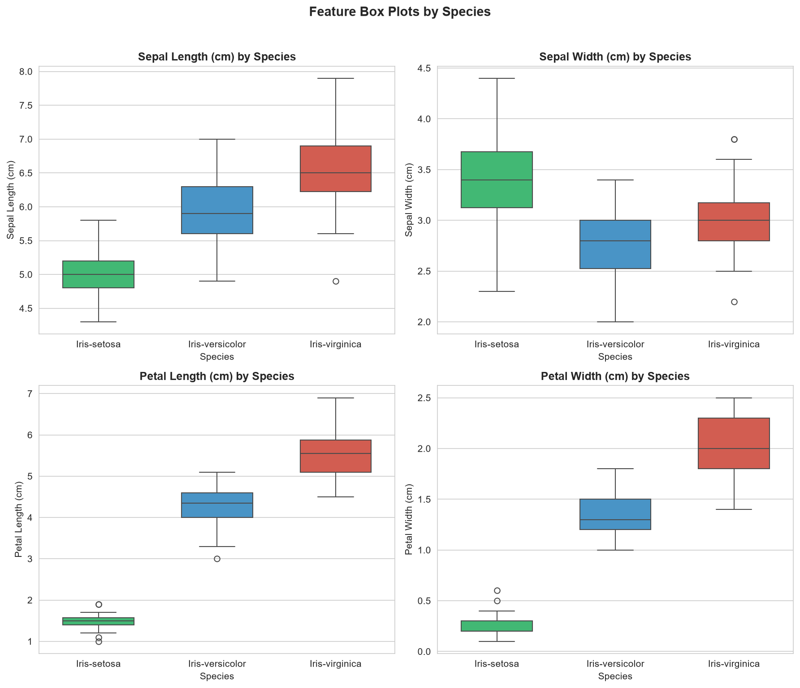

<div align="center">

# 🌸 Iris Flower Species Classifier

### Machine Learning Classification Dashboard


A production-quality machine learning project that classifies Iris flower species from petal and sepal measurements. Features a complete ML pipeline, model comparison framework, and a premium dark-themed interactive dashboard.

**CodeAlpha Data Science Internship Project**

[Features](#-features) · [Demo](#-live-demo) · [Installation](#-installation) · [Results](#-results) · [Author](#-author)

</div>

---

## 📋 Project overview

### Problem statement

Given four physical measurements of an Iris flower — **sepal length**, **sepal width**, **petal length**, and **petal width** — predict which of three species it belongs to: *Setosa*, *Versicolor*, or *Virginica*.

### Solution

An end-to-end machine learning pipeline that:

1. **Explores** the dataset with professional EDA visualizations
2. **Trains** three classification models with StandardScaler preprocessing
3. **Compares** models using accuracy, precision, recall, and F1 score
4. **Deploys** the best model through a premium interactive dashboard

### Architecture

```
┌──────────────┐     ┌──────────────┐     ┌──────────────┐     ┌──────────────┐
│  Data Layer  │────▶│  Processing  │────▶│   Training   │────▶│  Deployment  │
│              │     │              │     │              │     │              │
│  Iris.csv    │     │  Inspection  │     │  3 Models    │     │  Streamlit   │
│  150 samples │     │  Scaling     │     │  Comparison  │     │  Dashboard   │
│  4 features  │     │  Splitting   │     │  Selection   │     │  Plotly UI   │
└──────────────┘     └──────────────┘     └──────────────┘     └──────────────┘
```

---

## 🎯 Objectives

- Perform comprehensive exploratory data analysis with 6 professional visualizations
- Train and compare **Decision Tree**, **KNN**, and **Logistic Regression** classifiers
- Select the best model using multiple evaluation metrics
- Deploy an interactive prediction dashboard with real-time confidence scores
- Maintain production-quality, modular, documented code

---

## ✨ Features

| Feature | Description |
|---------|-------------|
| **Complete EDA pipeline** | Pair plots, correlation heatmaps, histograms, box plots |
| **3 ML models** | Decision Tree, K-Nearest Neighbors, Logistic Regression |
| **Auto model selection** | Best model chosen by accuracy with full metric comparison |
| **Premium dashboard** | Dark-themed Streamlit UI with glassmorphism cards |
| **Plotly charts** | Interactive probability visualization |
| **Live predictions** | Auto-updating results as feature values change |
| **Species encyclopedia** | Description, habitat, and facts for each species |
| **Modular codebase** | Separate modules for utils, preprocessing, training, prediction |

---

## 📊 Dataset

The classic **Iris dataset** introduced by Ronald Fisher (1936), sourced from the [UCI Machine Learning Repository](https://archive.ics.uci.edu/ml/datasets/iris).

| Feature | Description | Range |
|---------|-------------|-------|
| Sepal Length | Length of the sepal (cm) | 4.3 – 7.9 |
| Sepal Width | Width of the sepal (cm) | 2.0 – 4.4 |
| Petal Length | Length of the petal (cm) | 1.0 – 6.9 |
| Petal Width | Width of the petal (cm) | 0.1 – 2.5 |

**Target classes:** `Iris-setosa` · `Iris-versicolor` · `Iris-virginica` — 50 samples each, 150 total

---

## 🧪 Machine learning workflow

### Pipeline steps

| Step | Description | Module |
|------|-------------|--------|
| 1 | Load & inspect dataset | `src/preprocess.py` |
| 2 | Exploratory data analysis | `main.py` |
| 3 | Feature scaling (StandardScaler) | `src/preprocess.py` |
| 4 | Train 3 classifiers | `src/train.py` |
| 5 | Evaluate with 4 metrics | `src/train.py` |
| 6 | Select & save best model | `src/train.py` |
| 7 | Deploy dashboard | `app.py` |

### Models compared

| Model | Type | Key parameter |
|-------|------|---------------|
| **Decision Tree** | Tree-based | `random_state=42` |
| **K-Nearest Neighbors** | Instance-based | `n_neighbors=5` |
| **Logistic Regression** | Linear | `max_iter=200` |

---

## 📈 Results

### Model performance

| Model | Accuracy | Precision | Recall | F1 Score |
|-------|----------|-----------|--------|----------|
| **Decision Tree** | **100.00%** | **100.00%** | **100.00%** | **100.00%** |
| K-Nearest Neighbors | 100.00% | 100.00% | 100.00% | 100.00% |
| Logistic Regression | 100.00% | 100.00% | 100.00% | 100.00% |

> Results with `random_state=42`, 80/20 train-test split, StandardScaler preprocessing.

### EDA visualizations

<div align="center">
<table>
<tr>
<td></td>
<td></td>
</tr>
<tr>
<td align="center"><em>Feature pairplot by species</em></td>
<td align="center"><em>Correlation heatmap</em></td>
</tr>
<tr>
<td></td>
<td></td>
</tr>
<tr>
<td align="center"><em>Feature distributions</em></td>
<td align="center"><em>Box plots by species</em></td>
</tr>
<tr>
<td></td>
<td></td>
</tr>
<tr>
<td align="center"><em>Confusion matrix</em></td>
<td align="center"><em>Model accuracy comparison</em></td>
</tr>
</table>
</div>

### Key findings

- **Iris-setosa** is linearly separable from the other two classes
- **Petal measurements** are more discriminative than sepal measurements
- All three models achieve high accuracy on this well-separated dataset
- Petal length and petal width have the highest correlation (0.96)

---

## 🛠️ Technology stack

| Category | Tools |
|----------|-------|
| **Language** | Python 3.8+ |
| **ML** | Scikit-learn · Joblib |
| **Data** | Pandas · NumPy |
| **Visualization** | Matplotlib · Seaborn · Plotly |
| **Deployment** | Streamlit |

---

## 📁 Project structure

```
CodeAlpha_Iris_Flower_Classifier/
├── data/
│   └── Iris.csv                           # Dataset (150 samples)
├── notebooks/
│   └── Iris_Flower_Classification.ipynb   # Jupyter notebook
├── src/
│   ├── __init__.py                        # Package init
│   ├── utils.py                           # Constants & path helpers
│   ├── preprocess.py                      # Data inspection & scaling
│   ├── train.py                           # Training, evaluation, save/load
│   └── predict.py                         # Prediction with confidence
├── saved_model/
│   └── best_model.pkl                     # Trained model + scaler
├── outputs/graphs/                        # 6 EDA visualizations
├── .streamlit/config.toml                 # Dark theme configuration
├── app.py                                 # Streamlit dashboard
├── main.py                                # ML pipeline (13 steps)
├── requirements.txt                       # Dependencies
├── README.md
├── LICENSE                                # MIT
└── .gitignore
```

---

## 🚀 Installation

```bash
# Clone the repository
git clone https://github.com/sundeep-codes/CodeAlpha_Iris_Flower_Classifier.git
cd CodeAlpha_Iris_Flower_Classifier

# Create virtual environment (recommended)
python -m venv venv
source venv/bin/activate        # Linux / Mac
venv\Scripts\activate           # Windows

# Install dependencies
pip install -r requirements.txt
```

---

## 💻 Usage

### Run the ML pipeline

```bash
python main.py
```

Executes all 13 steps: data loading, inspection, EDA, preprocessing, model training, comparison, evaluation, model saving, and prediction demo.

### Launch the dashboard

```bash
streamlit run app.py
```

Opens the interactive prediction dashboard at `http://localhost:8501`.

### Programmatic predictions

```python
from src.predict import load_prediction_model, predict_with_confidence

model, scaler = load_prediction_model()
result = predict_with_confidence(model, [5.1, 3.5, 1.4, 0.2], scaler)

print(f"Species:    {result['predicted_species']}")
print(f"Confidence: {result['confidence']:.2%}")
```

---

## ☁️ Deployment

### Streamlit Cloud

1. Push the repository to GitHub
2. Go to [share.streamlit.io](https://share.streamlit.io)
3. Connect your GitHub account
4. Select the repository and set `app.py` as the main file
5. Click **Deploy**

The app will be available at a public URL.

---

## 🔮 Future improvements

- K-fold cross-validation for robust evaluation
- Feature importance analysis and visualization
- Streamlit Cloud deployment with public URL
- REST API endpoint using FastAPI
- Model versioning with MLflow
- Unit tests for the prediction pipeline

---

## 👨‍💻 Author

**Sundeep Patil**
CodeAlpha Data Science Intern

[](https://github.com/sundeep-codes)

---

## 📄 License

This project is licensed under the MIT License — see the [LICENSE](LICENSE) file for details.

---

<div align="center">

⭐ Star this repository if you found it useful!

*Built for the CodeAlpha Data Science Internship*

</div>
