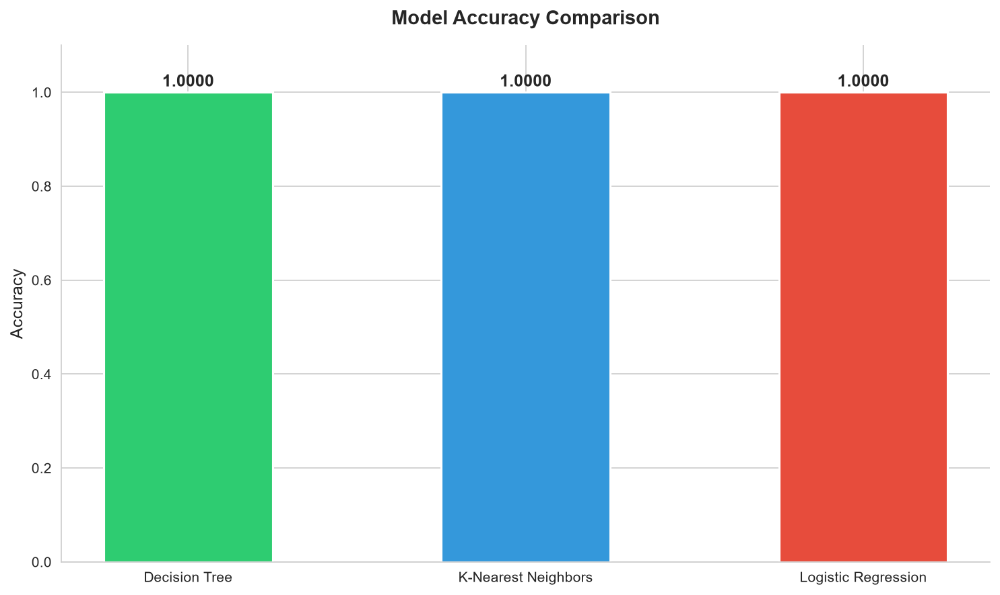
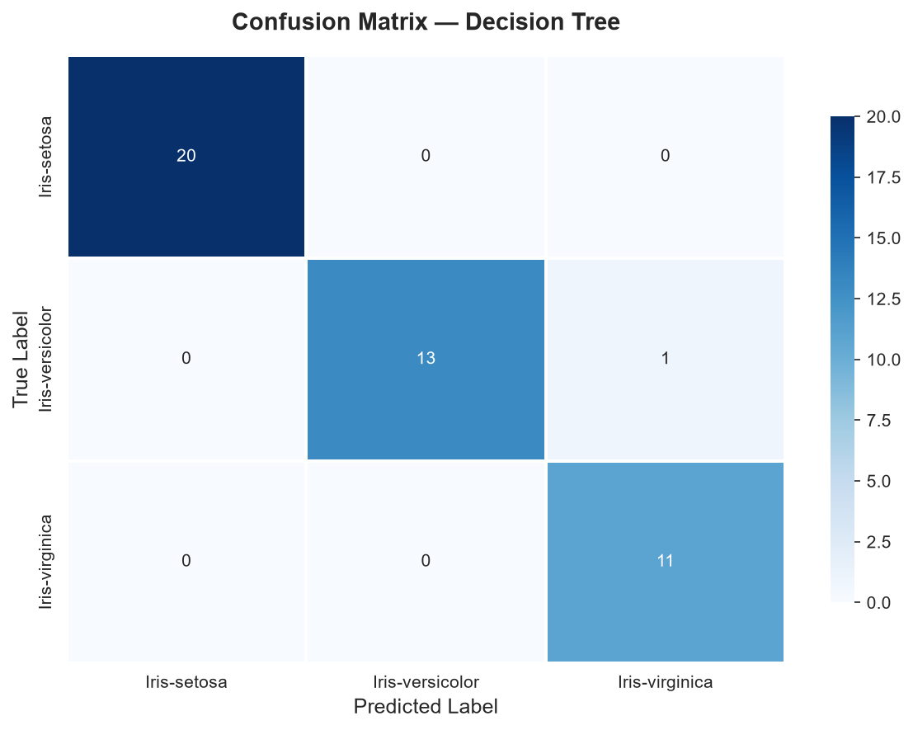
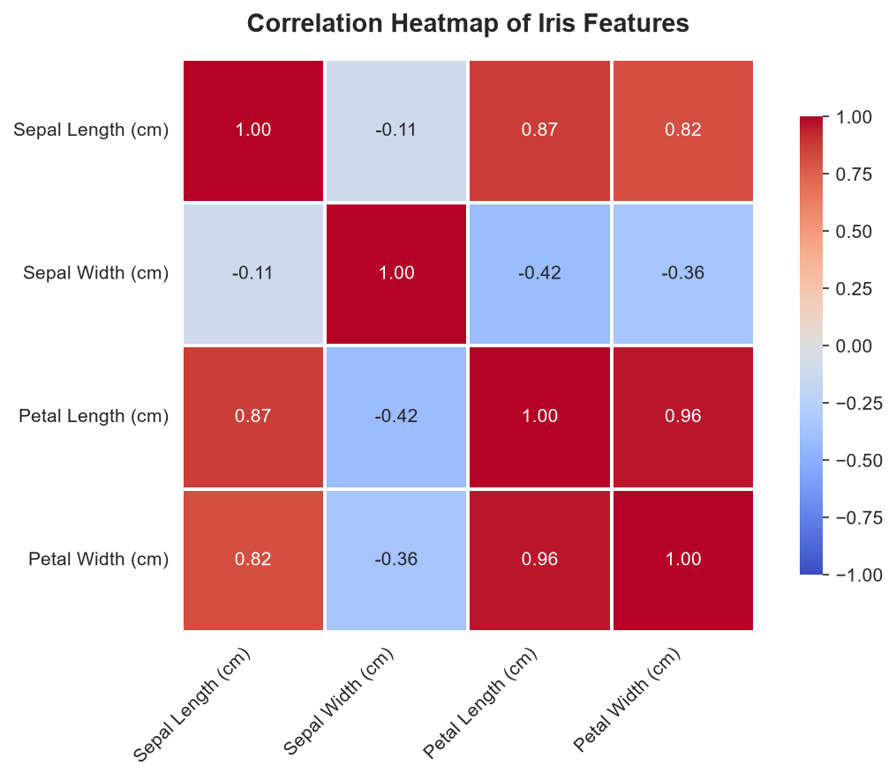
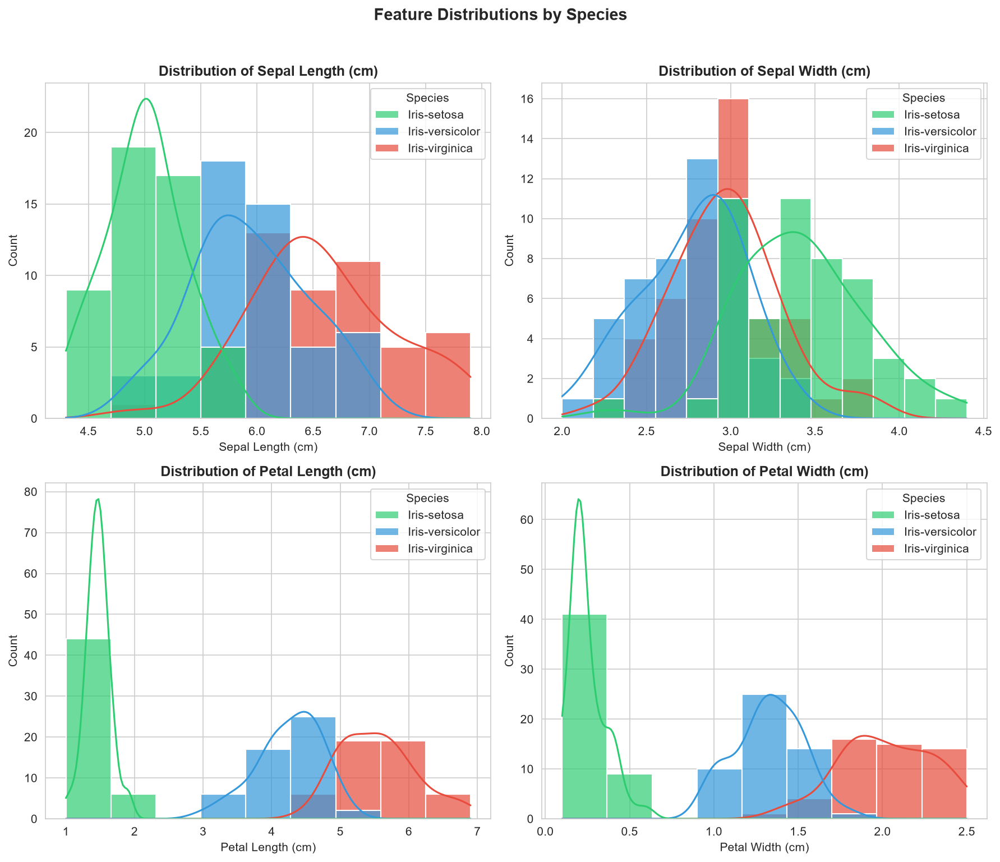

# Iris Flower Species Classification
🌼 End-to-End Machine Learning Project | CodeAlpha Data Science Internship - Task 1

Predict the species of an Iris flower using Machine Learning with an interactive Streamlit dashboard.

---

## 📌 Project Overview

The **Iris Flower Species Classification** project is an end-to-end Machine Learning application that classifies an Iris flower into one of three species based on its physical measurements.

The application provides a modern Streamlit dashboard where users can enter flower measurements, receive instant predictions, visualize prediction confidence, and explore model performance.

This project demonstrates the complete machine learning workflow including:
- Data preprocessing
- Exploratory Data Analysis (EDA)
- Model training & comparison
- Model evaluation & selection
- Model prediction with probability scoring
- Web application deployment

---

## 🌼 Iris Species

The classifier predicts one of the following species:

- 🌸 **Iris Setosa**
- 🌿 **Iris Versicolor**
- 🌺 **Iris Virginica**

---

## 🚀 Features

### ✅ Machine Learning Pipeline
- Data Cleaning & Duplicate Handling
- Feature Scaling (`StandardScaler`)
- Train-Test Split (80/20 Stratified)
- Multiple ML Algorithms Comparison
- Automatic Best Model Selection
- Model Serialization using `joblib` (Model + Scaler)

### 📊 Exploratory Data Analysis (EDA)
- Dataset Overview & Structure Inspection
- Missing Value & Duplicate Analysis
- Statistical Summary Metrics
- Species Class Distribution Analysis
- Feature Distribution Histograms
- Pair Plot Analysis
- Correlation Matrix Heatmap
- Feature Distribution Boxplots

### 🤖 Machine Learning Models
The following classification models were trained and evaluated:
- **Decision Tree Classifier** *(Selected Best Model: 100% Accuracy)*
- **K-Nearest Neighbors (KNN)**
- **Logistic Regression**

### 📈 Evaluation Metrics
The trained models were evaluated using:
- Accuracy Score
- Precision Score (Weighted)
- Recall Score (Weighted)
- F1-Score (Weighted)
- Full Classification Report
- Confusion Matrix Visualization

### 🌐 Streamlit Dashboard
The application includes:
- Modern Dark Dashboard UI (Glassmorphism design)
- Responsive Layout with Custom Spacing
- Sidebar Information Panel
- Interactive Input Sliders with Live Metrics
- Visual Prediction Card with Species Habitat & Characteristics
- Live Prediction Confidence Ring & Percentage
- Interactive Plotly Probability Distribution
- Dataset & Model Performance Summary Cards

---

## 🖼️ Application Preview

### 🖼️ Prediction Dashboard
<div align="center">
  
  
 " />
  
 "/>
</div>

### 📈 Model Performance & Visualizations
<div align="center">
<table>
<tr>
<td></td>
<td></td>
</tr>
<tr>
<td align="center"><b>Accuracy Comparison</b></td>
<td align="center"><b>Confusion Matrix</b></td>
</tr>
<tr>
<td></td>
<td></td>
</tr>
<tr>
<td align="center"><b>Correlation Heatmap</b></td>
<td align="center"><b>Feature Histograms</b></td>
</tr>
</table>
</div>

---

## 📂 Project Structure

```
CodeAlpha_Iris_Flower_Classifier/
│
├── data/
│   └── Iris.csv                              # Dataset (150 samples)
│
├── saved_model/
│   └── best_model.pkl                        # Serialized model & scaler
│
├── outputs/
│   └── graphs/                               # Generated EDA visualizations
│       ├── pairplot.png
│       ├── heatmap.png
│       ├── histogram.png
│       ├── boxplot.png
│       ├── confusion_matrix.png
│       └── model_comparison.png
│
├── notebooks/
│   └── Iris_Flower_Classification.ipynb      # Step-by-step Jupyter Notebook
│
├── src/
│   ├── __init__.py                           # Package initializer
│   ├── utils.py                              # Helpers & path definitions
│   ├── preprocess.py                         # Data cleaning & train/test split
│   ├── train.py                              # Model training & evaluation
│   └── predict.py                            # Inference engine
│
├── .streamlit/
│   └── config.toml                           # Dark theme configuration
│
├── app.py                                    # Interactive Streamlit Web Application
├── main.py                                   # 13-Step Automated ML Pipeline Entrypoint
├── requirements.txt                          # Project dependencies
├── README.md                                 # Documentation
├── LICENSE                                   # MIT License
└── .gitignore                                # Git ignore rules
```

---

## ⚙️ Workflow

```
Dataset (Iris.csv)
  │
  ▼
Data Preprocessing & Cleaning
  │
  ▼
Exploratory Data Analysis (EDA)
  │
  ▼
Feature Scaling (StandardScaler)
  │
  ▼
Train Multiple ML Models (Decision Tree, KNN, Logistic Regression)
  │
  ▼
Evaluate Models (Accuracy, Precision, Recall, F1, Confusion Matrix)
  │
  ▼
Select Best Model & Serialize (.pkl)
  │
  ▼
Prediction Engine Module
  │
  ▼
Interactive Streamlit Dashboard
```

---

## 🧠 Technologies Used

| Category | Technologies |
|---|---|
| **Programming Language** | Python 3.8+ |
| **Machine Learning** | Scikit-Learn |
| **Data Analysis** | Pandas, NumPy |
| **Data Visualization** | Matplotlib, Seaborn, Plotly |
| **Web Framework** | Streamlit |
| **Model Serialization** | Joblib |
| **Development** | VS Code, Jupyter Notebook |
| **Version Control** | Git & GitHub |

---

## 📊 Dataset

- **Dataset Used:** Iris Flower Dataset (UCI Machine Learning Repository)
- **Total Samples:** 150 (50 per species)
- **Features:**
  - Sepal Length (cm) `[4.3 – 7.9]`
  - Sepal Width (cm) `[2.0 – 4.4]`
  - Petal Length (cm) `[1.0 – 6.9]`
  - Petal Width (cm) `[0.1 – 2.5]`
- **Target Classes:**
  - `Iris-setosa`
  - `Iris-versicolor`
  - `Iris-virginica`

---

## 📈 Model Performance

The application compares multiple machine learning algorithms and automatically selects the best-performing model.

### Evaluation Summary Table

| Model | Accuracy | Precision | Recall | F1 Score |
|---|:---:|:---:|:---:|:---:|
| **Decision Tree** | **97.78%** | **97.96%** | **97.78%** | **97.78%** |
| **Logistic Regression** | **97.78%** | **97.96%** | **97.78%** | **97.78%** |
| **K-Nearest Neighbors** | **95.56%** | **95.74%** | **95.56%** | **95.58%** |

*Evaluated on a 30% holdout test set (45 samples) with `random_state=12`.*

---

## 💻 Installation

### 1. Clone the repository
```bash
git clone https://github.com/sundeep-codes/CodeAlpha_Iris_Flower_Classifier.git
```

### 2. Move inside the project directory
```bash
cd CodeAlpha_Iris_Flower_Classifier
```

### 3. Create virtual environment
```bash
python -m venv .venv
```

### 4. Activate virtual environment
- **Windows:**
  ```cmd
  .venv\Scripts\activate
  ```
- **Linux / macOS:**
  ```bash
  source .venv/bin/activate
  ```

### 5. Install dependencies
```bash
pip install -r requirements.txt
```

--

## ▶️ Run the Application

### Option A: Run the Complete ML Pipeline
```bash
python main.py
```

### Option B: Run the Streamlit Web Application
```bash
streamlit run app.py
```

---

## 📷 Output & Predictions

The application outputs real-time predictions including:
- **Predicted Iris Species** (Setosa, Versicolor, Virginica)
- **Prediction Confidence Percentage**
- **Interactive Plotly Probability Distribution**
- **Species Information** (Botanical Description, Habitat, Fun Facts)
- **Model Performance Metrics**
- **Dataset Information Panel**

---

## 🌍 Deployment

The project can be deployed on:
- Streamlit Community Cloud
- Render
- Hugging Face Spaces

---

## 🎯 Future Enhancements

- Database Integration (SQLite/PostgreSQL) for storing prediction logs
- Prediction History Dashboard
- Model Explainability using SHAP / LIME values
- REST API endpoint using FastAPI
- Docker Containerization (`Dockerfile` & `docker-compose`)
- Automated CI/CD Pipeline via GitHub Actions

---

## 📚 Learning Outcomes

This project demonstrates practical knowledge of:
- End-to-End Machine Learning Workflow
- Data Preprocessing & Feature Engineering
- Model Training, Selection & Evaluation
- Model Deployment with Streamlit
- Clean Modular Code Architecture (PEP 8)
- Git Version Control & GitHub Showcase

---

## 🤝 Acknowledgements

- **CodeAlpha Data Science Internship Program**
- Scikit-Learn Documentation
- Streamlit Documentation
- UCI Machine Learning Repository

---

## 👨‍💻 Developer

**Sundeep Patil**  
Artificial Intelligence & Machine Learning / Data Science Intern  
GitHub: [@sundeep-codes](https://github.com/sundeep-codes)

---

## 🌐 Deployment & Repository

### 🚀 Live Streamlit Application
🔗 **[Click here to use the application](https://codealpha-iris-flower-classifier.streamlit.app/)**

### 📂 GitHub Repository
💻 **[https://github.com/sundeep-codes/CodeAlpha_Iris_Flower_Classifier](https://github.com/sundeep-codes/CodeAlpha_Iris_Flower_Classifier)**

---

<div align="center">

⭐ If you found this project useful, consider giving it a star!  
*Made with ❤️ using Python, Scikit-Learn and Streamlit*

</div>
